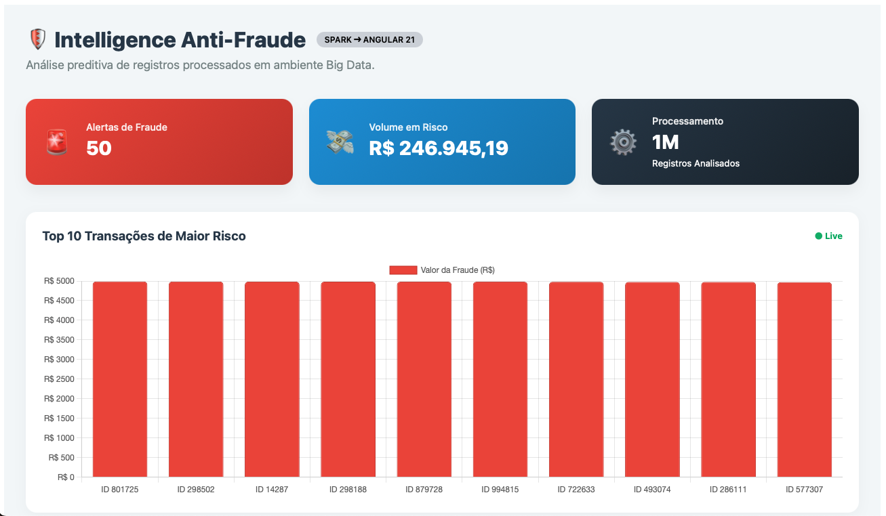

# 📊 Sistema de Detecção de Fraudes com Big Data

Este projeto implementa um sistema robusto de detecção de fraudes utilizando Apache Spark para processamento distribuído, MinIO como Object Storage (simulando AWS S3) e Angular para visualização em uma interface web interativa.

---

## 🚀 Objetivo

Simular um cenário de análise de fraude em transações financeiras utilizando conceitos e ferramentas de Big Data, focando no desacoplamento entre processamento e armazenamento.

---

## 🧠 Características de Big Data atendidas

- **Volume**: Geração e processamento de 1 milhão de registros.
- **Variedade**: Dados estruturados com múltiplos atributos (valor, país, dispositivo, horário, tentativas).
- **Velocidade**: Arquitetura preparada para evolução com processamento em tempo real (streaming).
- **Veracidade**: Aplicação de regras de negócio para filtragem de anomalias em grandes conjuntos de dados.

---

## ⚙️ Arquitetura (Moderna e Desacoplada)

O projeto utiliza o conceito de Decoupled Compute and Storage, onde o processamento (Spark) é independente do armazenamento (MinIO/S3).

[Spark ETL] ➔ [MinIO Object Storage (S3)] ➔ [API FastAPI] ➔ [Frontend Angular]




---

## 🔄 Pipeline de Dados

1. Geração de Dados: Criação de 1.000.000 de transações simuladas via PySpark.
2. Transformação (ETL): Aplicação de lógica de detecção de fraude e enriquecimento de dados.
3. Persistência Distribuída: Gravação dos resultados no MinIO utilizando o protocolo S3A (simulando um Data Lake na nuvem).
4. Exposição (Serving): API FastAPI consome os arquivos JSON diretamente do Object Storage.
5. Visualização: Frontend Angular apresenta os dados em gráficos e tabelas paginadas.

---

## 🔍 Regras de Fraude

O sistema utiliza o motor do Spark para classificar transações em tempo recorde:

- ALTA_SUSPEITA: Valor > 2000, País fora do BR e >= 3 tentativas.
- MEDIA_SUSPEITA: Valor > 800, Horário entre 00h e 06h e >= 1 tentativa.
- NORMAL: Transações que não atendem aos critérios de risco.

---

## ☁️ Armazenamento com MinIO (S3)

Em vez do HDFS tradicional, este projeto utiliza o MinIO, um Object Storage de alta performance compatível com a API do Amazon S3.

- Bucket: fraudes
- Protocolo: s3a://
- Vantagem: Facilidade de migração para nuvens públicas (AWS, GCP, Azure) sem alteração de código.


---

## 🖥️ Tecnologias Utilizadas

- Apache Spark (PySpark): Processamento distribuído.
- MinIO: Object Storage compatível com S3.
- FastAPI (Python): API REST de alta performance.
- Angular 18+: Framework frontend.
- Docker & Docker Compose: Orquestração de containers.
- Chart.js: Gráficos dinâmicos.

---

## ▶️ Como Executar o Projeto

Recomendamos o uso do Docker para subir toda a infraestrutura (MinIO + API).

### 1. Clonar o repositório
```bash
git clone https://github.com/LenildoLourenco/mba-big-data-fraud-detection.git
cd projeto-mba-spark
```

---

### 2. Subir a Infraestrutura (Docker)

Este comando sobe o MinIO e a API FastAPI automaticamente:

```bash
docker compose up --build -d
```

---

### 3. Executar o processamento com Spark

Certifique-se de estar com o ambiente virtual ativo e as dependências instaladas para rodar o script que envia dados ao MinIO:

```bash
cd spark
python3 app_spark.py
```

---

### 4. Executar o Frontend (Angular)

```bash
cd frontend
npm install
ng serve
```
Acesse: http://localhost:4200

---

## 📌 Diferenciais Técnicos

- Arquitetura Resiliente: Uso de RDDs (implícitos) e DataFrames para tolerância a falhas.
- Lazy Evaluation: Otimização de consultas antes da execução real.
- CORS Configurado: Comunicação segura entre Frontend e API.
- Escalabilidade: O sistema pode ser movido para um cluster EMR (AWS) ou Databricks com alterações mínimas.